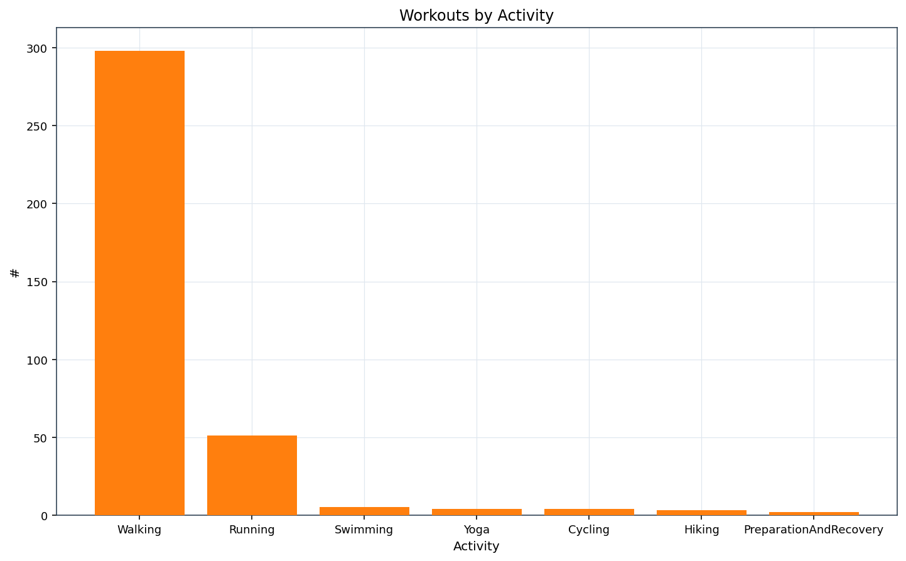
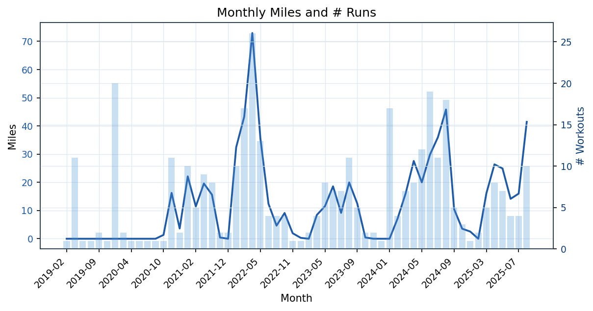
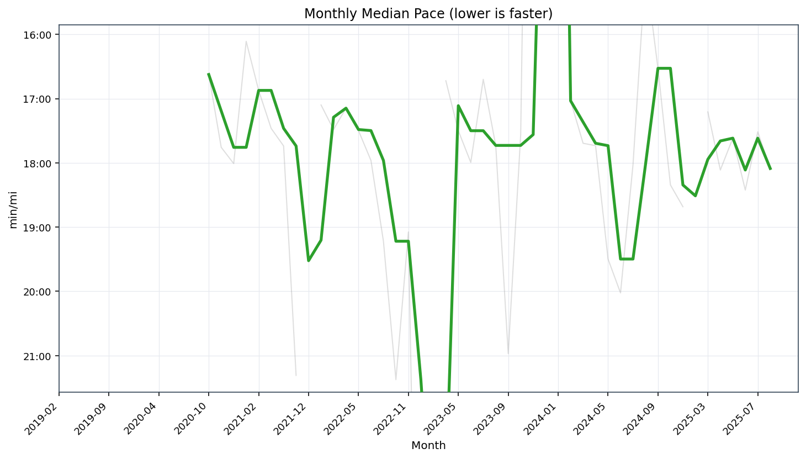
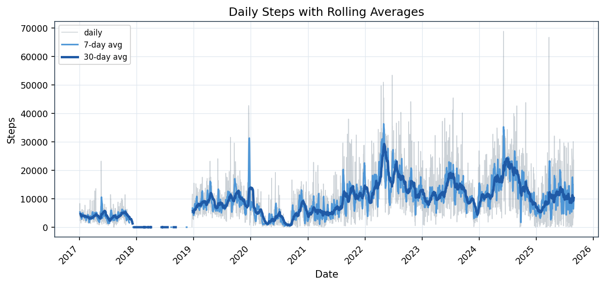

# Apple Health Analytics Toolkit

Turn your Apple Health export into a rich, self‑contained analytics report: normalized tables, plots, and Markdown pages you can browse in GitHub or VS Code.

Key capabilities
- Convert Apple Health export (export.xml + GPX routes + ECG CSVs) into clean Parquet/CSV tables.
- Analyze Running, Steps, Body/Composition, Vitals, Sleep, Alerts.
- Generate multi‑year visuals and summaries: monthly/weekly trends, PRs, outliers, HR zones/TRIMP, efficiency, calendars, correlations, and more.
- Opinionated styling: faint “raw” series with bold smoothed trends where it helps readability.
- Reports are plain Markdown with PNGs; you can open the index directly in your repo.

Example output

[Index](./out/reports/index.md) | [Running](./out/reports/running.md) | [Steps](./out/reports/steps.md) | [Body](./out/reports/body.md) | [Vitals](./out/reports/vitals.md) | [Sleep](./out/reports/sleep.md) | [Alerts](./out/reports/alerts.md)

Quick gallery









What’s included (sections)
- Running: monthly miles and runs, median pace (mm:ss), weekly mileage, load (TRIMP, A:C), PR timeline, devices, outliers, multi‑year calendars (miles/day, newest → oldest).
- Steps: daily/weekly/monthly views, goal adherence, distribution, DoW effects, correlations, cumulative vs goal per year, yearly totals (human‑friendly units), calendars (newest → oldest).
- Body & Composition: weight (lb), body fat %, BMI; smoothed bridges to connect gaps.
- Vitals: RHR 7D, HRV 7D, VO2 30D, Walking HR 7D, BP, SpO2 — faint actuals with bold smoothed lines.
- Sleep and Alerts (ECG summaries).

Notes
- “Runs” aggregate Running + Walking workouts (indoor/outdoor). Peloton sessions are included in counts, but workouts without distance/pace won’t appear in pace/distance plots.
- Environment/weather plots are currently disabled by default.

Quick start
1) Prerequisites
- macOS/Linux, Python 3.11+ recommended (works on 3.13 in this repo).
- System packages: libxml2/libxslt (for lxml) if building from source.

2) Create a virtual environment and install deps
```bash
python3 -m venv .venv
source .venv/bin/activate
python -m pip install -U pip
pip install pandas numpy matplotlib lxml gpxpy click rich pyyaml
```

3) Place your Apple Health export
- Export from the Health app on iPhone → “Export All Health Data”. Unzip to `apple_health_export/` at the repo root so paths look like:
  - `apple_health_export/export.xml`
  - `apple_health_export/workout-routes/*.gpx`
  - `apple_health_export/electrocardiograms/*.csv`

4) Run end‑to‑end
```bash
# Clean outputs
rm -rf out

# Convert → normalized bundle (Parquet/CSV)
PYTHONPATH=src .venv/bin/python -m healthkit.cli convert \
  --xml apple_health_export/export.xml \
  --routes apple_health_export/workout-routes \
  --ecg apple_health_export/electrocardiograms \
  --out out \
  --tz America/Denver

# Analyze → plots + Markdown reports
PYTHONPATH=src .venv/bin/python -m healthkit.cli analyze \
  --in-normalized out \
  --out out \
  --tz America/Denver \
  --weather off \
  --config config/sample_health.yaml
```

5) Browse reports
- Open out/reports/index.md — it links to Running, Steps, Body, Vitals, Sleep, and Alerts.

FAQ / tips
- Why do “Runs” include Walking? We purposely merge Running + Walking (indoor/outdoor) so volume and frequency reflect all foot‑based sessions. Pace‑based charts still use effective pace (lower is faster) and you can filter in code if you prefer only Running.
- My Peloton workouts don’t show in pace charts. Apple exports often omit distance for Peloton sessions. They count in totals and source charts, but without distance they won’t appear in pace/distance plots.
- It’s slow to rebuild from scratch. Use the two‑step flow: run `convert` once, then iterate with `analyze --in-normalized out` to re‑render plots quickly.
- Time window: set `--start YYYY-MM-DD` and/or `--end` or set `cutoff_start` in `config/sample_health.yaml`.
- Units: weight plots render in lb; BMI uses height from data or `height_cm` in config.
- Calendars: Running calendars show daily miles; Steps calendars show daily steps. Both render newest → oldest in reports.

Validation checklist
```bash
# Running calendars exist
ls -1 out/plots/running | grep calendar_runs_

# All PNGs embedded in Running (expect no output)
comm -3 <(ls -1 out/plots/running | sort) \
        <(rg -o "../plots/running/[^)]+" out/reports/running.md | sed 's#../plots/running/##' | sort) | cat

# Index overview contains top plots
rg -n "Overview|run_monthly_miles_and_runs|steps_daily_rolling|body_weight_trend" out/reports/index.md
```

Project structure
- `src/healthkit/cli.py` — pipeline entry points (`convert`, `analyze`).
- `src/healthkit/reports.py` — Markdown writers and index.
- `src/healthkit/plots.py` — general plotting helpers and style.
- `src/steps/*` — steps analysis and plots.
- `src/analysis/*` — running analytics (trends, load, devices, PRs, routes).
- `out/` — generated tables, plots, and Markdown reports.

Contributing
- Issues and PRs welcome. Please exclude personal data (`apple_health_export/`) from commits; the repo already ignores it.

Configuration
- See `config/sample_health.yaml` for defaults like `cutoff_start` and `height_cm`.
- Command‑line flags on `analyze` let you set goals (steps/weight), stride, time window, etc.

Data model (selected outputs)
- out/workout_stats.parquet — workouts with effective distance/time, miles, pace, HR metrics.
- out/daily_summary.parquet — daily rollups (steps, RHR, VO2, sleep, etc.).
- out/tables/* — CSVs used by the reports.
- out/plots/* — PNGs grouped by section.
- out/reports/*.md — Markdown reports (index.md is the entry point).

Committing outputs
- The repo tracks `out/` so you can view the reports on GitHub (see .gitignore rules below).
- Your raw Apple Health export (`apple_health_export/`) is excluded by .gitignore and will not be committed.

Typical development loop
```bash
# After tweaking code or config
PYTHONPATH=src .venv/bin/python -m healthkit.cli analyze --in-normalized out --out out --tz America/Denver --weather off --config config/sample_health.yaml

# Rebuild from scratch (slower, safest)
rm -rf out && \
PYTHONPATH=src .venv/bin/python -m healthkit.cli convert --xml apple_health_export/export.xml --routes apple_health_export/workout-routes --ecg apple_health_export/electrocardiograms --out out --tz America/Denver && \
PYTHONPATH=src .venv/bin/python -m healthkit.cli analyze --in-normalized out --out out --tz America/Denver --weather off --config config/sample_health.yaml
```

Tests
```bash
pytest -q
```

Versioning and data privacy
- Don’t commit `apple_health_export/` (ignored). The generated `out/` reports and tables are committed for reproducibility and easy sharing.
