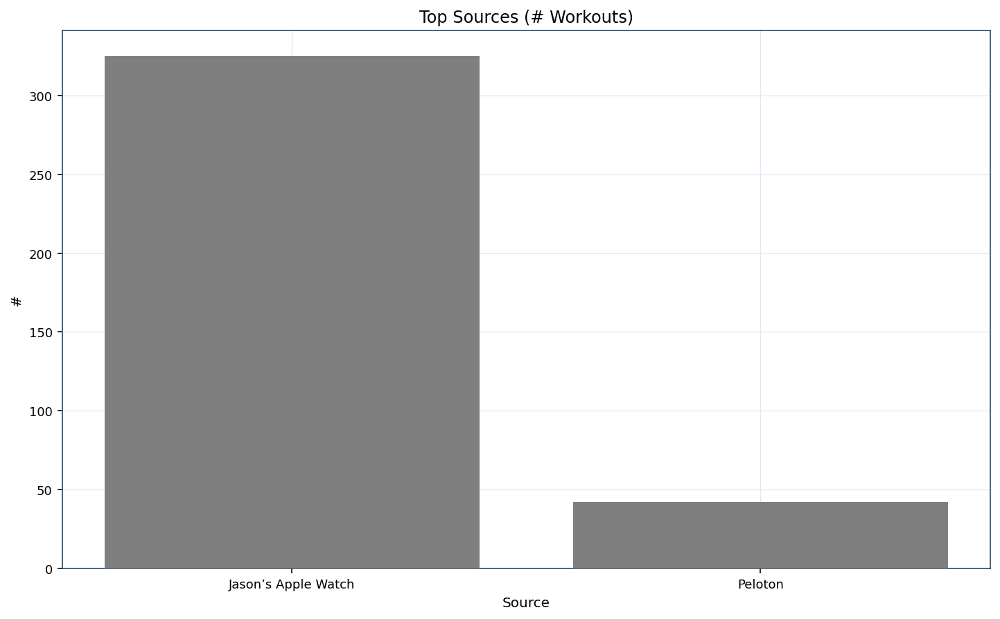

[Index](./index.md) | [Running](./running.md) | [Steps](./steps.md) | [Body](./body.md) | [Vitals](./vitals.md) | [Sleep](./sleep.md) | [Alerts](./alerts.md)

# Health Analytics

## Overview

## Sections
- [Running](./running.md)
- [Steps](./steps.md)
- [Body](./body.md)
- [Vitals](./vitals.md)
- [Sleep](./sleep.md)
- [Alerts](./alerts.md)

## Data Summary

### Charts

#### Workouts by Activity

#### Top Sources

### Workouts by Activity
| activity | total | with_distance | with_hr | with_route |
| --- | --- | --- | --- | --- |
| Walking | 298 | 263 | 0 | 263 |
| Running | 51 | 11 | 0 | 11 |
| Swimming | 5 | 0 | 0 | 0 |
| Cycling | 4 | 4 | 0 | 4 |
| Yoga | 4 | 0 | 0 | 0 |
| Hiking | 3 | 3 | 0 | 3 |
| PreparationAndRecovery | 2 | 0 | 0 | 0 |

### Top Sources
| source_name | count |
| --- | --- |
| Jason’s Apple Watch | 325 |
| Peloton | 42 |
