[Index](./index.md) | [Running](./running.md) | [Steps](./steps.md) | [Body](./body.md) | [Vitals](./vitals.md) | [Sleep](./sleep.md) | [Alerts](./alerts.md)

# Running

## run_monthly_miles_and_runs.png

## run_monthly_median_pace.png

## run_weekly_mileage.png
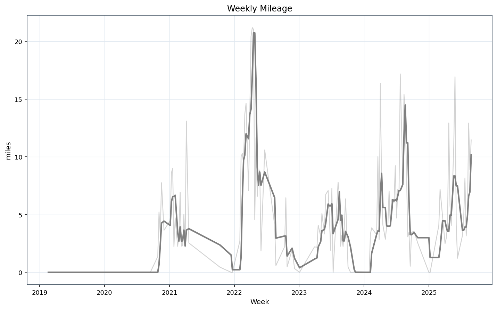

## run_zone_distribution.png
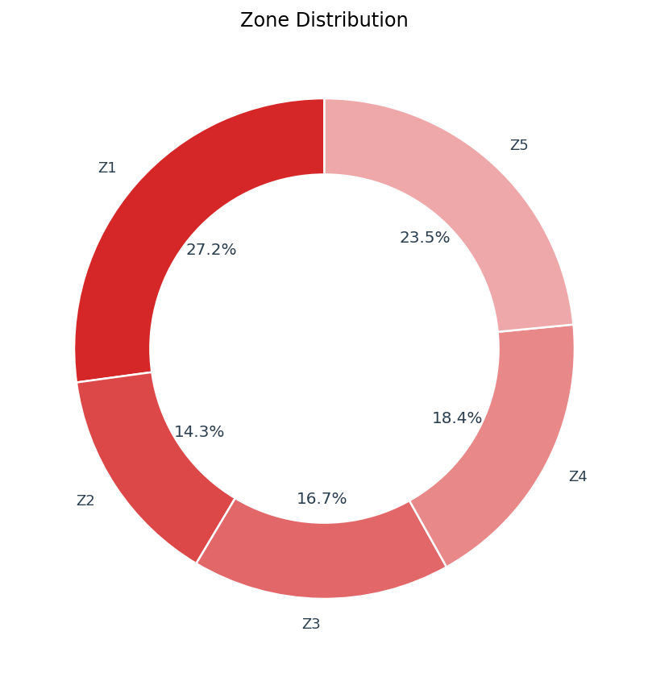

## Calendars

### calendar_runs_2025.png
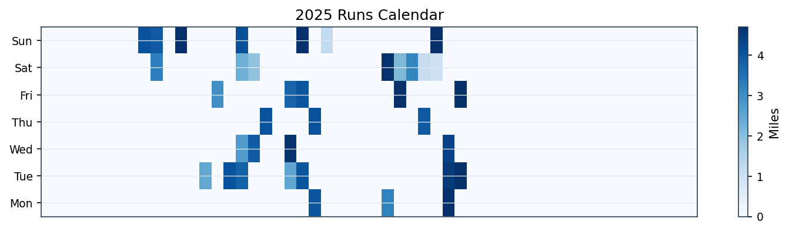

### calendar_runs_2024.png
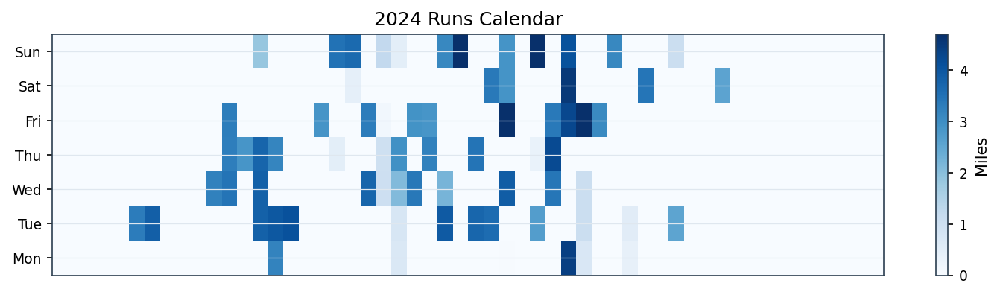

### calendar_runs_2023.png
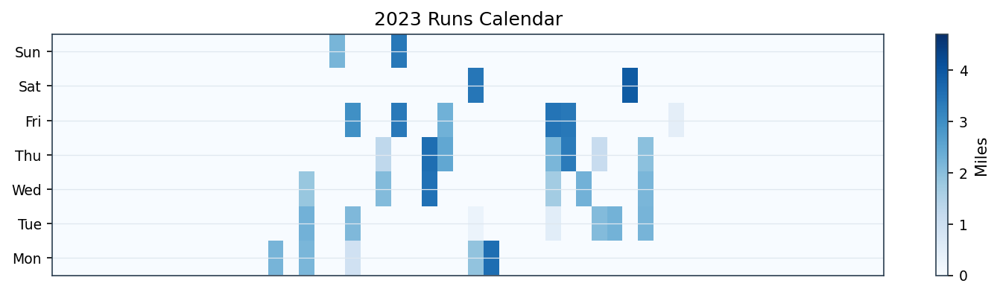

### calendar_runs_2022.png
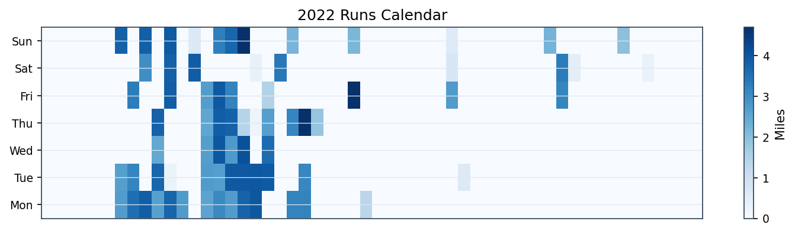

### calendar_runs_2021.png
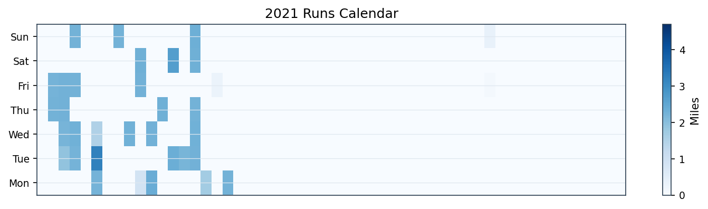

### calendar_runs_2020.png
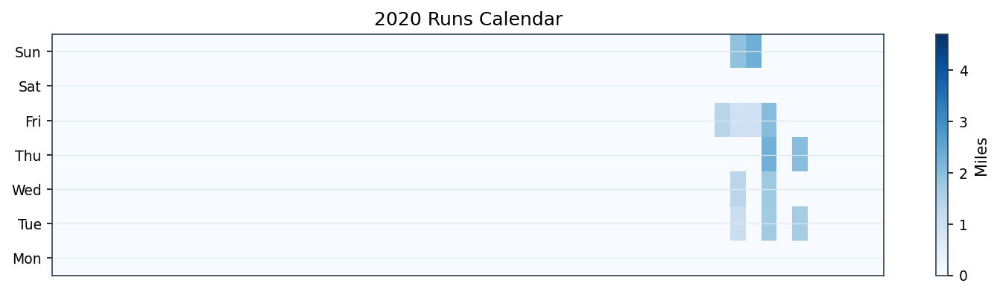

## run_acute_chronic.png
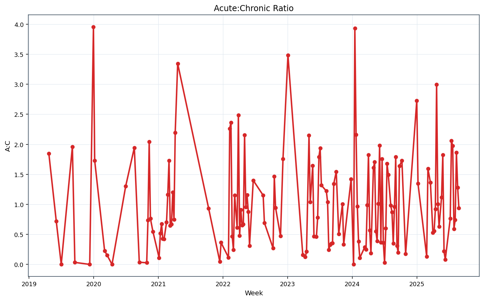

## run_correlation_matrix.png
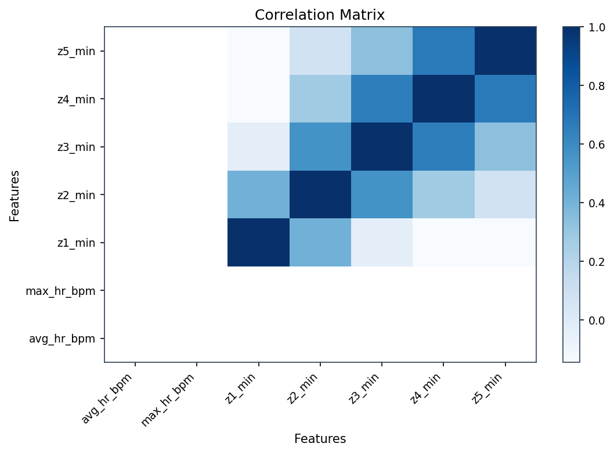

## run_device_bias_bar.png
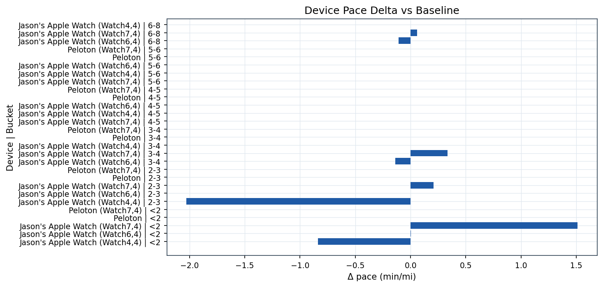

## run_device_bucket_heatmap.png
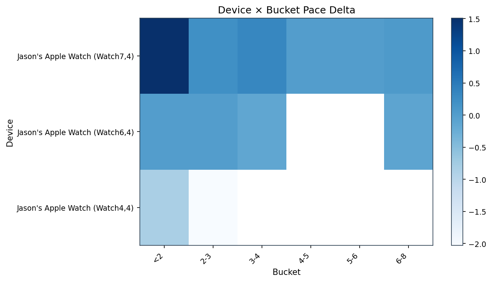

## run_pr_timeline.png
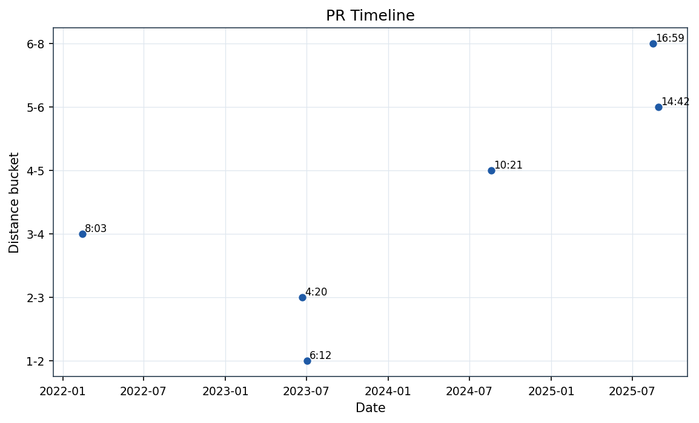

## run_weekly_trimp.png
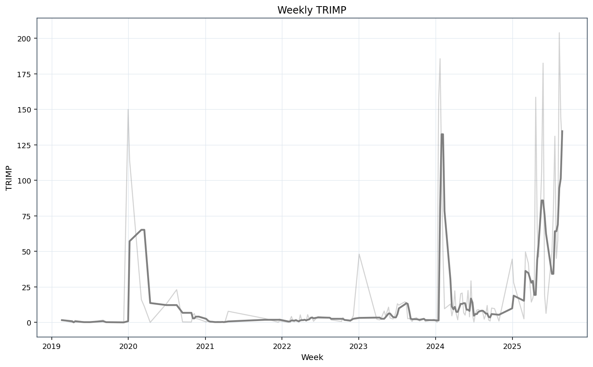

## Tables

### run_monthly_perf.csv
| month | avg_pace | median_pace | avg_miles_per_workout | total_miles | workouts |
| --- | --- | --- | --- | --- | --- |
| 2019-02 | nan | nan | nan | 0.0 | 1 |
| 2019-04 | nan | nan | nan | 0.0 | 11 |
| 2019-06 | nan | nan | nan | 0.0 | 1 |
| 2019-07 | nan | nan | nan | 0.0 | 1 |
| 2019-09 | nan | nan | nan | 0.0 | 2 |
| 2019-12 | nan | nan | nan | 0.0 | 1 |
| 2020-01 | nan | nan | nan | 0.0 | 20 |
| 2020-03 | nan | nan | nan | 0.0 | 2 |
| 2020-04 | nan | nan | nan | 0.0 | 1 |
| 2020-07 | nan | nan | nan | 0.0 | 1 |
| 2020-08 | nan | nan | nan | 0.0 | 1 |
| 2020-09 | nan | nan | nan | 0.0 | 1 |
| 2020-10 | 16.624249752906213 | 16.624249752906213 | 1.3634734403878237 | 1.3634734403878237 | 1 |
| 2020-11 | 17.305509490106434 | 17.75833115302691 | 1.6262418604342952 | 16.26241860434295 | 11 |
| 2020-12 | 18.01107172212013 | 18.01107172212013 | 1.821307563954761 | 3.642615127909522 | 2 |

### run_weekly_mileage.csv
| week | miles | workouts |
| --- | --- | --- |
| 2019-02-19 | 0.0 | 1 |
| 2019-04-09 | 0.0 | 4 |
| 2019-04-16 | 0.0 | 5 |
| 2019-04-23 | 0.0 | 2 |
| 2019-06-04 | 0.0 | 1 |
| 2019-07-02 | 0.0 | 1 |
| 2019-09-03 | 0.0 | 1 |
| 2019-09-17 | 0.0 | 1 |
| 2019-12-10 | 0.0 | 1 |
| 2019-12-31 | 0.0 | 12 |
| 2020-01-07 | 0.0 | 8 |
| 2020-03-03 | 0.0 | 1 |
| 2020-03-17 | 0.0 | 1 |
| 2020-04-14 | 0.0 | 1 |
| 2020-06-30 | 0.0 | 1 |

### run_yearly_perf.csv
| year | avg_pace | median_pace | avg_miles_per_workout | total_miles | workouts |
| --- | --- | --- | --- | --- | --- |
| 2019.0 | nan | nan | nan | 0.0 | 17.0 |
| 2020.0 | 17.361652930631603 | 17.751109786718565 | 1.6360390132800229 | 21.268507172640295 | 40.0 |
| 2021.0 | 17.29530768049763 | 17.334665700896583 | 2.0370561106347074 | 69.25990776158005 | 36.0 |
| 2022.0 | 18.00434080821446 | 17.61618523619076 | 2.728465184151328 | 212.8202843638036 | 80.0 |
| 2023.0 | 16.907078071787392 | 17.72414440977385 | 2.1813849656306292 | 80.71124372833329 | 49.0 |
| 2024.0 | 17.690583156734586 | 17.84243302402014 | 2.458848108207196 | 199.1666967647829 | 105.0 |
| 2025.0 | 18.56195044669689 | 17.622446114037547 | 3.659363701996649 | 139.05582067587267 | 40.0 |

### run_prs_by_bucket.csv
| bucket | workout_id | date | pace_min_per_mile | miles | activity |
| --- | --- | --- | --- | --- | --- |
| 1-2 | acf586c21394a84755bed3b4b3cd697e8985f14b | 2023-07-03 | 6.20072801666033 | 1.905694945034709 | Cycling |
| 2-3 | cfa137e9865cd5360a6eb32f247d5de761451a58 | 2023-06-22 | 4.338653774553043 | 2.493099037963233 | Walking |
| 3-4 | 32f67ff4af039ec4325ca73de246b15fa11c0ef8 | 2022-02-14 | 8.052795215659268 | 3.574337121857544 | Walking |
| 4-5 | 5756aa4be9b7df32820a0c6d1c75f1ed2f5fafd7 | 2024-08-19 | 10.341844975163331 | 4.417340135010411 | Walking |
| 5-6 | de5798151b0acab06944311a6e0167807514b7c9 | 2025-08-29 | 14.70801470910919 | 5.76217880669299 | Walking |
| 6-8 | 34c168105a5de1bcc69c039ed93b70a8b0b0de83 | 2025-08-17 | 16.98371859421266 | 5.885062677550427 | Walking |

### run_outliers_pace_z.csv
| workout_id | start_utc | miles | pace_min_per_mile_eff | z_pace | is_exceptional | is_struggle |
| --- | --- | --- | --- | --- | --- | --- |
| e5a06c4c37e0cd2472163c63be96dbea464506f7 | 2020-10-30 13:41:42+00:00 | 1.3634734403878237 | 16.624249752906213 | -0.4626058748020217 | False | False |
| 98ca594883ea197cd123767f180760572e8b261c | 2020-11-03 16:59:30+00:00 | 1.0328018428675625 | 17.751109786718565 | -0.2012108017873381 | False | False |
| a905d669b54b47d14e12cd0e67bf0bcc0d123b1d | 2020-11-04 15:58:35+00:00 | 1.3360708095566345 | 18.973592436771924 | 0.0823656247265991 | False | False |
| 705c516340673f2f150db794991e993d44898b3c | 2020-11-06 18:13:41+00:00 | 0.945825557684328 | 17.973760716476544 | -0.1495629890204105 | False | False |
| c9fb37511b1a17279463cc8051c720e090fe91ea | 2020-11-08 17:09:16+00:00 | 1.9108375582974808 | 18.66550882934401 | 0.0109001945561845 | False | False |
| 57956150c7e3ade8a92cbbacd682337bf15c5f77 | 2020-11-13 20:18:46+00:00 | 0.9888074299596812 | 17.765552519335255 | -0.1978605550542998 | False | False |
| 368a43c0f1b203d57ea945df584c88b4c1e7931d | 2020-11-17 23:45:23+00:00 | 1.7085152439716325 | 18.52490270570507 | -0.0217158774066893 | False | False |
| ab325159f2c78229ac349339fde402145c83c897 | 2020-11-18 23:35:03+00:00 | 1.7586931271773865 | 17.683629291644813 | -0.2168640935960773 | False | False |
| c4874ab21111728b37213910f6367ac0da5fc697 | 2020-12-01 21:01:58+00:00 | 1.644014441819034 | 17.46744877125763 | -0.2670109807119354 | False | False |
| 223f1638daace74cb5362211e8d9a250d5f3280a | 2020-12-03 23:12:44+00:00 | 1.9986006860904877 | 18.55469467298263 | -0.014805104792435 | False | False |
| 4d8910f446f48f6455a2b1a3ddac6703d774f50a | 2021-01-12 19:21:55+00:00 | 1.8896540124796577 | 12.744869184088037 | -1.3624966656815871 | False | False |
| a1de1743219b0968ae98022fefd55b0186cd34fa | 2021-02-03 21:58:16+00:00 | 1.5023948731931855 | 21.487968409164623 | 0.6656195082336627 | False | False |
| 607cd1c4fc207bb1f29da72f53d8bbebf14846df | 2021-03-01 19:59:33+00:00 | 0.8767007847919033 | 21.938364230134127 | 0.7700967680309844 | False | False |
| c23b316cdf5f226d35717c65203fb845c26b8f0c | 2021-04-12 20:36:57+00:00 | 1.6777804556925713 | 19.89736868971081 | 0.2966518305025341 | False | False |
| 67eb12ea62c786a64a7cc208ed8c53a0a66d0611 | 2021-04-23 22:03:20+00:00 | 0.2852425190362387 | 17.64584698187405 | -0.2256283671747392 | False | False |

### run_weekly_trimp.csv
| week | weekly_trimp |
| --- | --- |
| 2019-02-19 | 1.5833333333333333 |
| 2019-04-09 | 0.0 |
| 2019-04-16 | 0.05 |
| 2019-04-23 | 1.4 |
| 2019-06-04 | 0.3166666666666666 |
| 2019-07-02 | 0.0 |
| 2019-09-03 | 1.65 |
| 2019-09-17 | 0.0166666666666666 |
| 2019-12-10 | 0.0 |
| 2019-12-31 | 149.86666666666667 |
| 2020-01-07 | 114.33333333333331 |
| 2020-03-03 | 16.03333333333333 |
| 2020-03-17 | 11.233333333333333 |
| 2020-04-14 | 0.0 |
| 2020-06-30 | 13.133333333333333 |

### run_acute_chronic.csv
| week | weekly_trimp | acute_7d | chronic_28d | ac_ratio |
| --- | --- | --- | --- | --- |
| 2019-02-19 | 1.5833333333333333 | 1.5833333333333333 | nan | nan |
| 2019-04-09 | 0.0 | 0.0 | nan | nan |
| 2019-04-16 | 0.05 | 0.05 | nan | nan |
| 2019-04-23 | 1.4 | 1.4 | 0.7583333333333333 | 1.846153846153846 |
| 2019-06-04 | 0.3166666666666666 | 0.3166666666666666 | 0.4416666666666666 | 0.7169811320754716 |
| 2019-07-02 | 0.0 | 0.0 | 0.4416666666666666 | 0.0 |
| 2019-09-03 | 1.65 | 1.65 | 0.8416666666666666 | 1.9603960396039608 |
| 2019-09-17 | 0.0166666666666666 | 0.0166666666666666 | 0.4958333333333333 | 0.0336134453781512 |
| 2019-12-10 | 0.0 | 0.0 | 0.4166666666666666 | 0.0 |
| 2019-12-31 | 149.86666666666667 | 149.86666666666667 | 37.88333333333333 | 3.956005279366477 |
| 2020-01-07 | 114.33333333333331 | 114.33333333333331 | 66.05416666666666 | 1.730902668264682 |
| 2020-03-03 | 16.03333333333333 | 16.03333333333333 | 70.05833333333334 | 0.2288569049601522 |
| 2020-03-17 | 11.233333333333333 | 11.233333333333333 | 72.86666666666666 | 0.1541628545288197 |
| 2020-04-14 | 0.0 | 0.0 | 35.4 | 0.0 |
| 2020-06-30 | 13.133333333333333 | 13.133333333333333 | 10.1 | 1.3003300330033003 |
