[Index](./index.md) | [Running](./running.md) | [Steps](./steps.md) | [Body](./body.md) | [Vitals](./vitals.md) | [Sleep](./sleep.md) | [Alerts](./alerts.md)

# Sleep

## sleep_calendar_2017.png
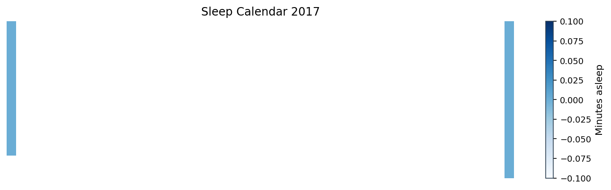

## sleep_calendar_2018.png
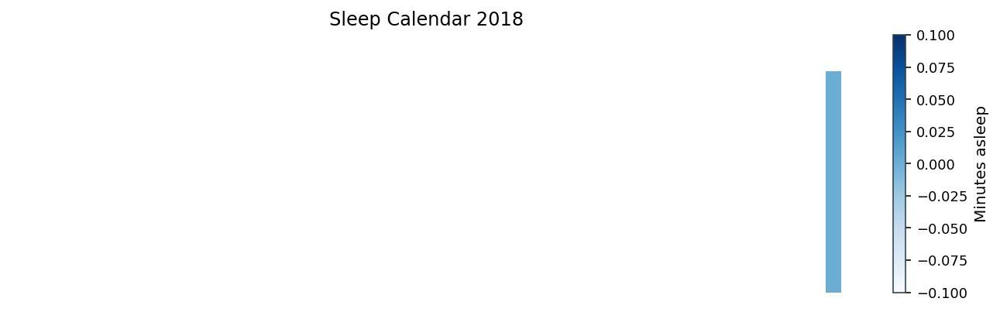

## sleep_calendar_2019.png
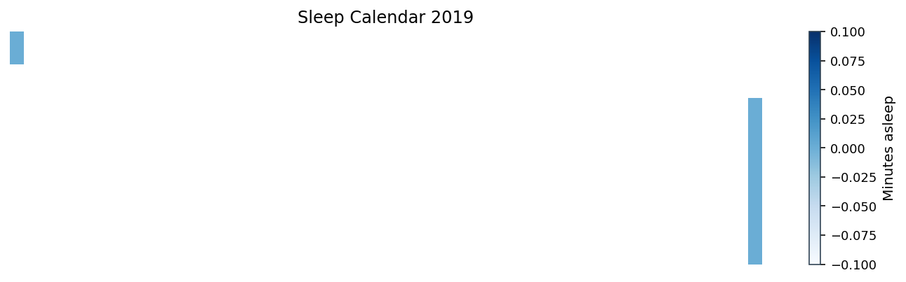

## sleep_calendar_2020.png
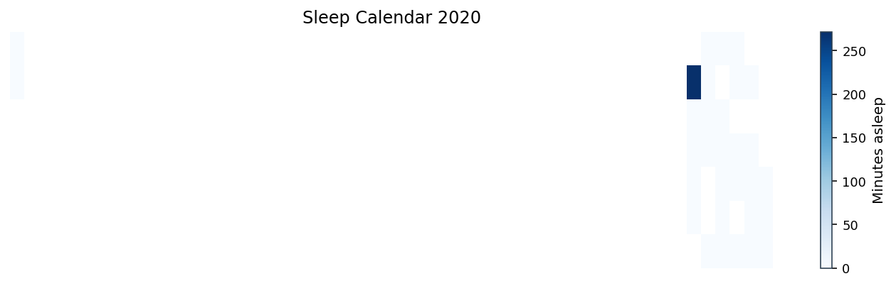

## sleep_calendar_2021.png
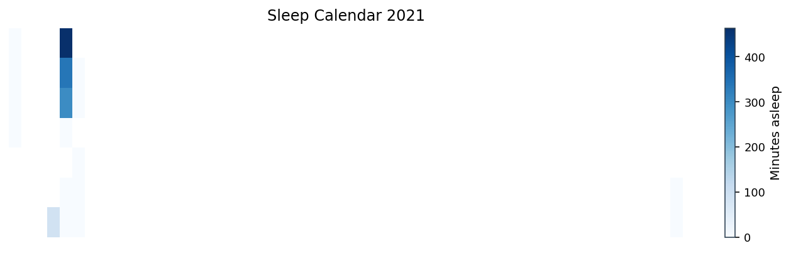

## sleep_calendar_2022.png
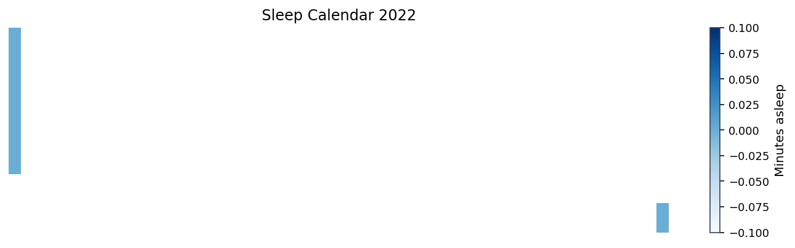

## sleep_calendar_2023.png

## sleep_calendar_2024.png
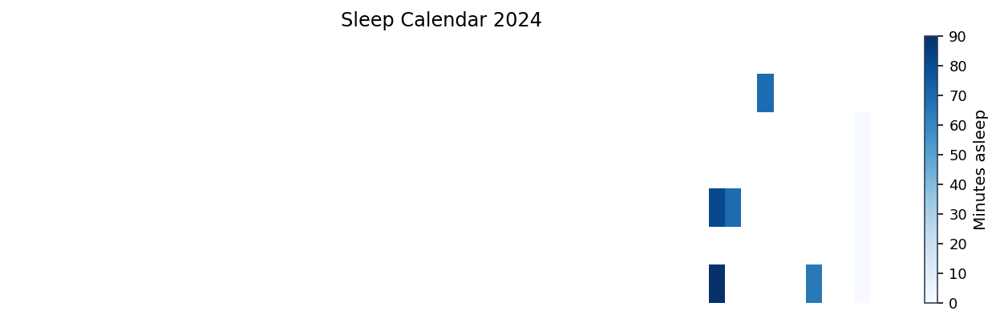

## sleep_calendar_2025.png
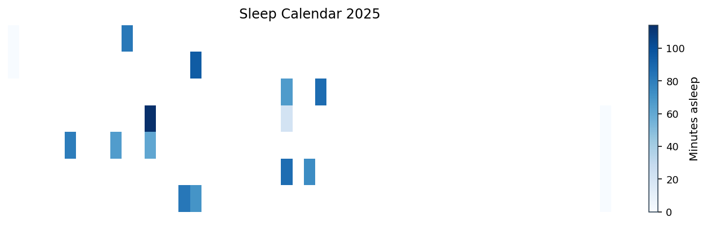

## sleep_debt_rolling.png
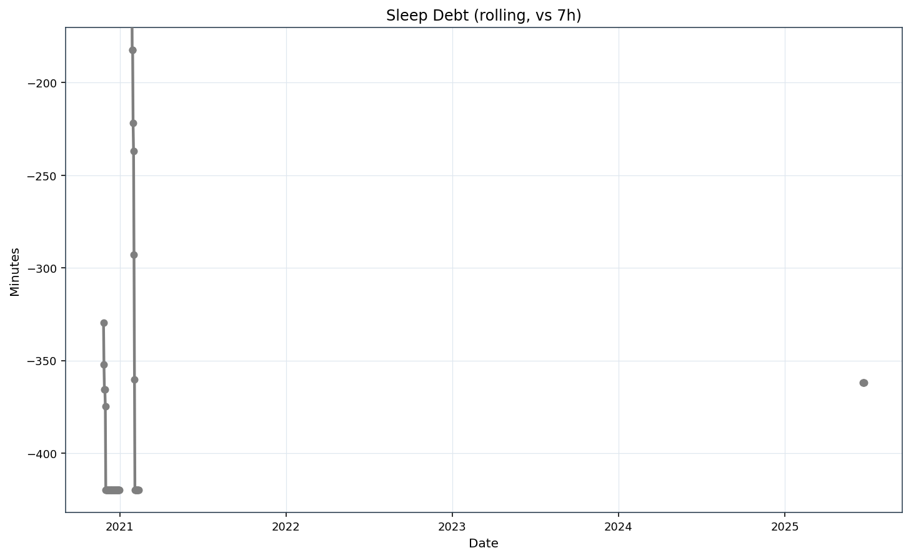

## sleep_dow_avg.png
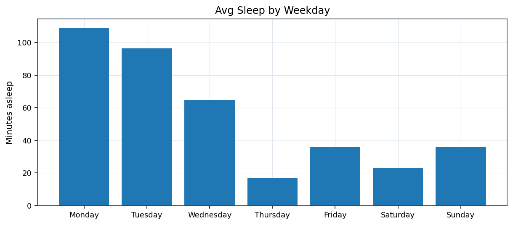

## sleep_duration_stacked.png
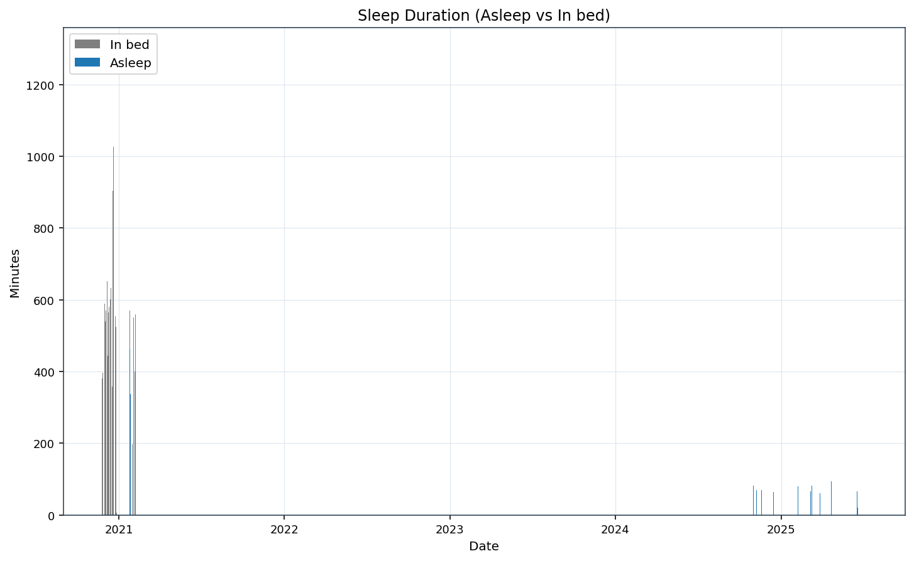

## sleep_efficiency_trend.png
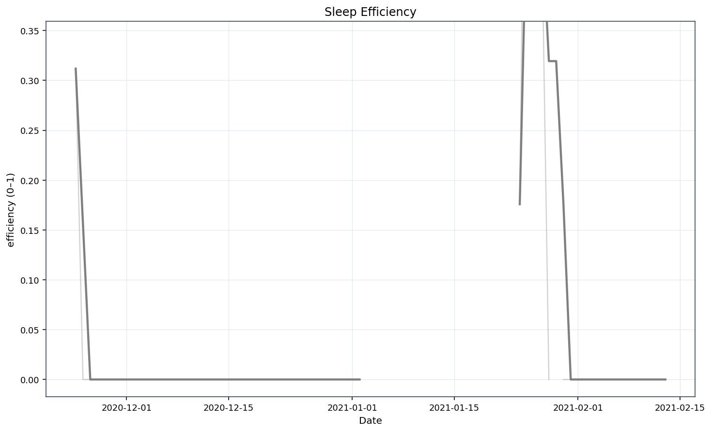

## sleep_vs_rhr.png
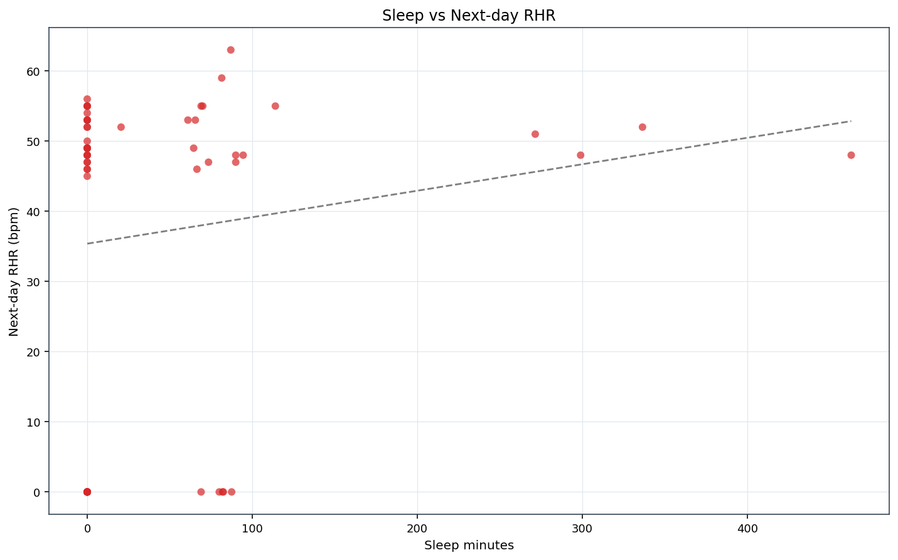

## sleep_vs_steps.png
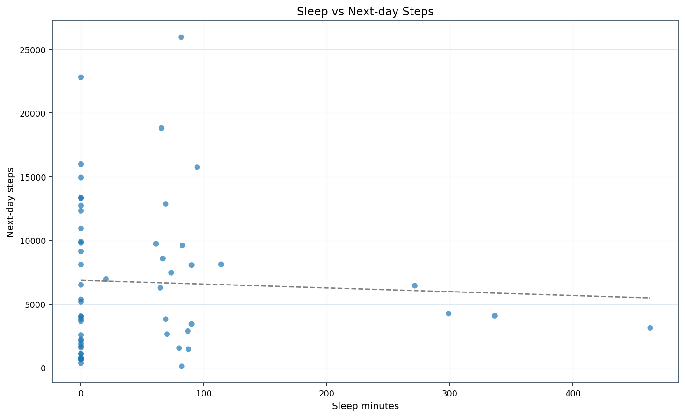
