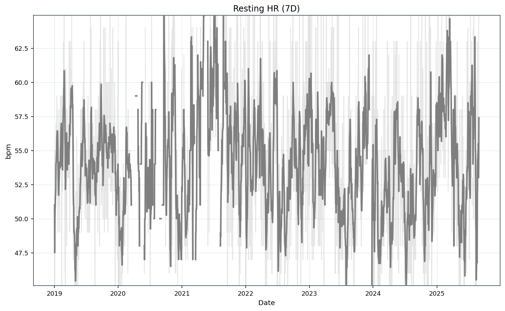
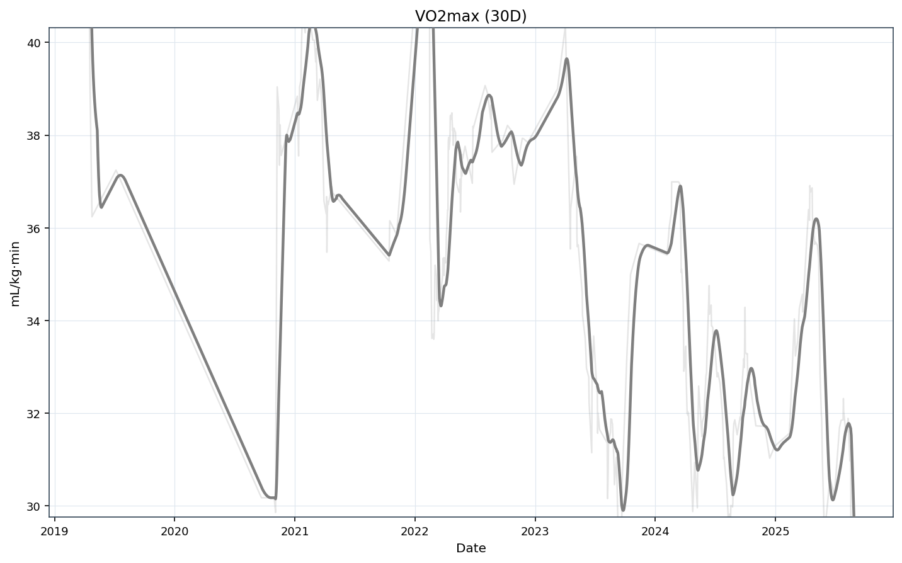
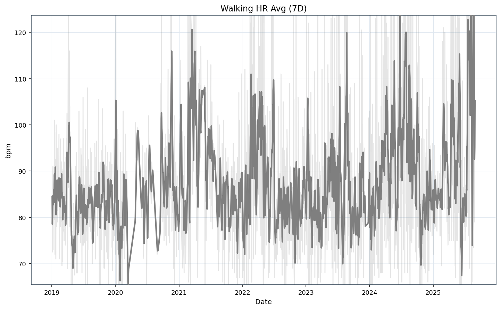
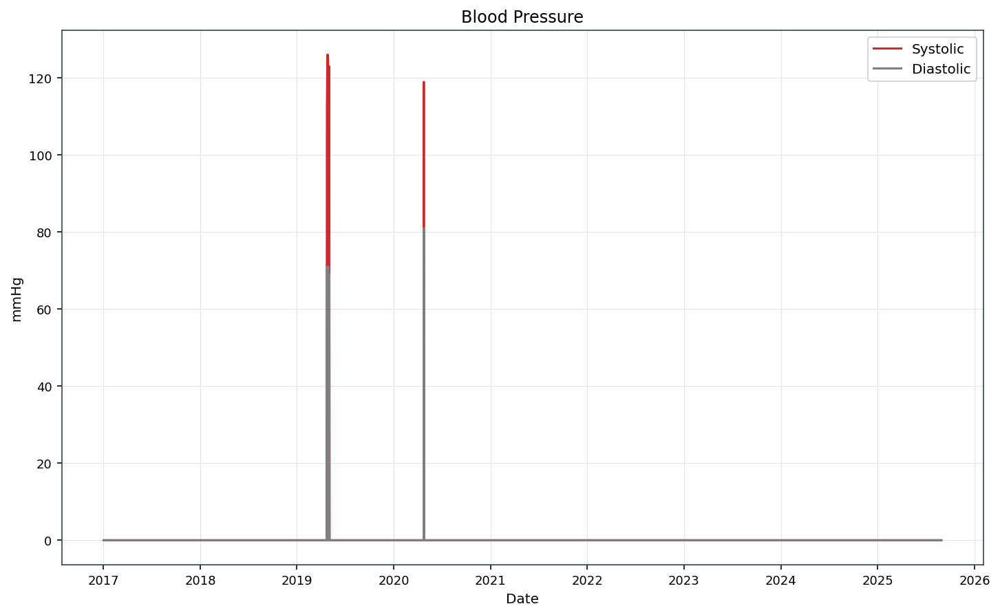
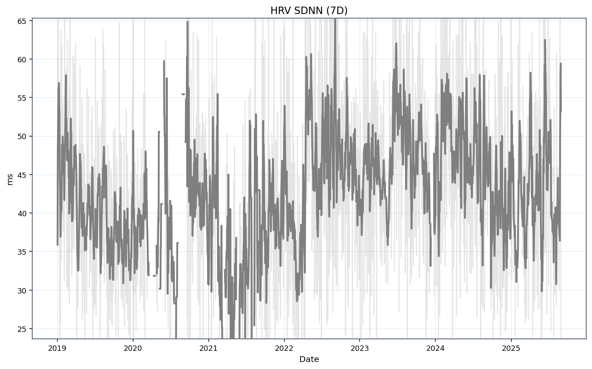
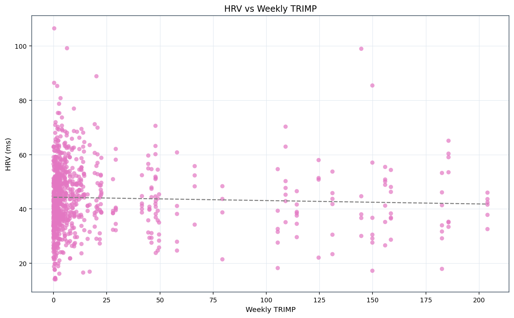
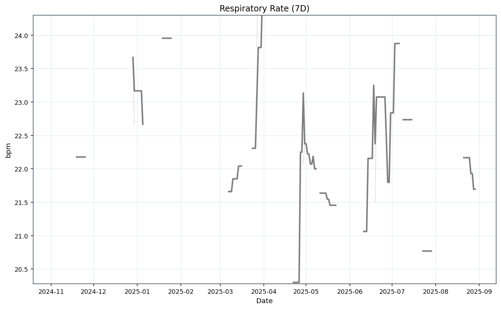
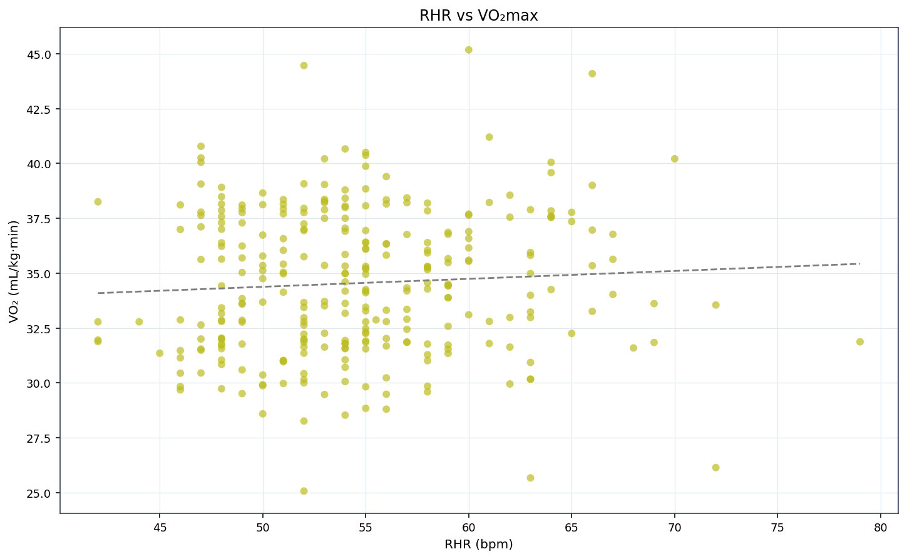
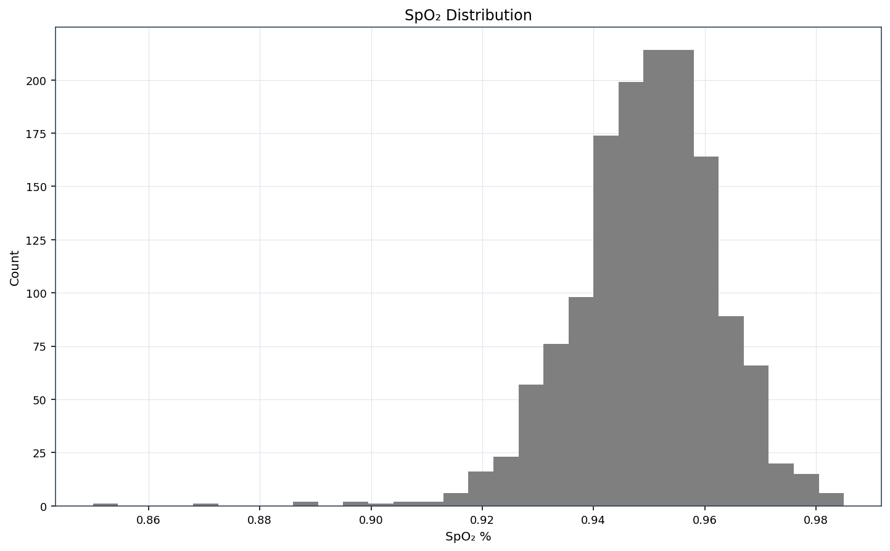

[Index](./index.md) | [Running](./running.md) | [Steps](./steps.md) | [Body](./body.md) | [Vitals](./vitals.md) | [Sleep](./sleep.md) | [Alerts](./alerts.md)

# Vitals

## vitals_rhr_trend.png

## vitals_vo2_trend.png

## vitals_walking_hr_avg_trend.png

## vitals_bp_trend.png

## vitals_hrv_trend.png

## vitals_hrv_vs_trimp.png

## vitals_resp_rate_trend.png

## vitals_rhr_vs_vo2.png

## vitals_spo2_hist.png

